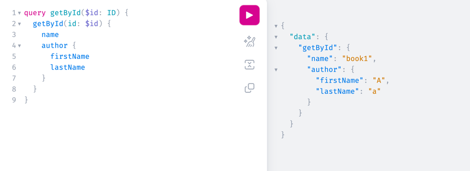

# graphql入门

> 今天浏览博客时看到graphQL,之前在招聘网站上第一次接触,以为是图数据查询语言,
> 简单了解后,发现对graphQL的介绍主要是作为**API的查询语言**,不仅限于图数据查询

如图：**自定义返回的数据体字段**




## 它的作用
graphQL是一种API查询语言,什么是API查询语言呢?并不是指用来查询API的,而是用来查询API提供的数据,一种为API而生的查询语言。
它通过提供一种灵活、精确的查询方式，解决了传统RESTful API的一些局限性，使得客户端能够更加高效地获取所需的数据。
那么传统API有哪些问题呢?以下两点是我比较认可的
- 返回的数据结构是固定的。要么字段多了,要么字段少了。这种情况应该都经历过,字段多了,虽然调用者可以自行挑选需要的字段,但数据结构庞杂且占用带宽,字段少了
则需要调整后端接口。
- 接口数量太多。操作一个数据实体，CRUD没跑了。也正因为接口太多，才会有各种接口管理规范和工具，比如swagger、apifox等。

上述问题，graphQL如何解决的？

- 接口返回的**数据字段由调用方自行决定**。客户端可以根据schema自行决定查询哪些字段属性，不存在过多或不足。
- **单一端点**，对，没有错，一个系统只有一个接口。只要你想，你可以将员工、保险、立项这些风马牛不相及的对象都杂糅在一起 （当然，按照我们工程化、模块化的管理思路，以及高内聚的思想，还是按照领域进行划分，也便于维护管理）
上述这两条已经让人眼前一亮了，不是吗？至于有些地方提到的graphQL相较于RESTful API的优势，比如复杂数据需要多次查询，接口版本演进等，
我个人觉得这些并不是RESTful 的问题，而是在于接口设计的问题。接口设计如果有问题，再好的工具也会疲软。


  
## demo示例
光说不太直观，通过demo感受一些graphQL的魅力（之前没注意到，spring官网居然也给出了GraphQL对应的入门demo）
### 依赖引入

```xml
<dependency>
    <groupId>org.springframework.boot</groupId>
    <artifactId>spring-boot-starter-graphql</artifactId>
</dependency>
<dependency>
    <groupId>org.springframework.boot</groupId>
    <artifactId>spring-boot-starter-web</artifactId>
</dependency>
```

### 定义schema

```graphql
# @author: yuanye.wang
# 查询类型
type Query{
    # 通过ID查询
    getById(id: ID): Book
    # 通过name查询
    #bookByName(name: String!) :[Book]
}

# 变异类型
type Mutation{
    createBook(name: String, pageCount: Int!, authorFirstName: String, authorLastName:String): Book
    #updateBook(id: ID, name: String!, pageCount: Int!): Book
    #deleteBook(id:ID): String
}

# 自定义类型
type Author {
    id: ID
    firstName: String
    lastName: String
}
type Book {
    id: ID
    name: String
    pageCount: Int
    author: Author
}

```
### 定义GrapQL端点
```java
@RestController
public class BookController {
    @Autowired
    BookService bookService;

    // @SchemaMapping(typeName = "Query", value = "getById")
    @QueryMapping(value = "getById")
    public Book getById2(@Argument String id) {
        return bookService.getById(id);
    }

    @MutationMapping(value = "createBook")
    public Book createBook(@Argument String name,
                           @Argument int pageCount,
                           @Argument String authorFirstName,
                           @Argument String authorLastName) {
        return bookService.createBook(name,pageCount,authorFirstName,authorLastName);
    }
}

```
### 运行测试
IDEA 、apifox中都可以执行，也可以开启graphql内置的浏览器工具: `spring.graphql.graphiql.enabled=true` ,以IDEA http举例：

```http request
### 自定义查询
GRAPHQL http://localhost:8081/graphql

query  getById($id: ID) {
  getById(id: $id) {
      # 自定义返回对象的字段
      id
      name
      pageCount
      author {
          id
          firstName
          lastName
      }

  }
}

{
   "id": "1"
}

### 新增，和查询同一个端口
GRAPHQL http://localhost:8081/graphql

mutation  createBook($name: String, $pageCount: Int!, $authorFirstName: String, $authorLastName: String) {
  createBook(name: $name, pageCount: $pageCount, authorFirstName: $authorFirstName, authorLastName: $authorLastName) {
      id
      name
      pageCount
      author {
          id
          firstName
          lastName
      }

  }
}

{
   "name": "demo",
   "pageCount": "666",
   "authorFirstName": "fname",
   "authorLastName": "lname"
}
```

### 一些坑
1. IDEA中GraphQL插件创建的文件是`xxx.graphql`,导致项目启动失败，需要改为 `xxx.graphqls`（spring官网demo有提到，没留意这个**s**，花了很长时间解决）
2. 请求端口是`/graphql`, 浏览器UI工具是 `/graphiql` 
